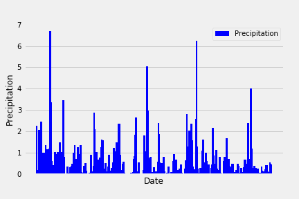
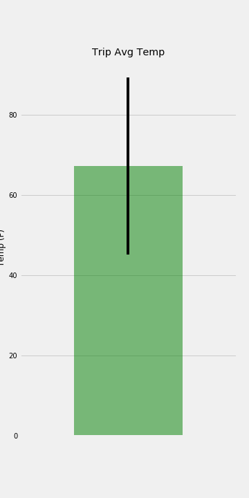
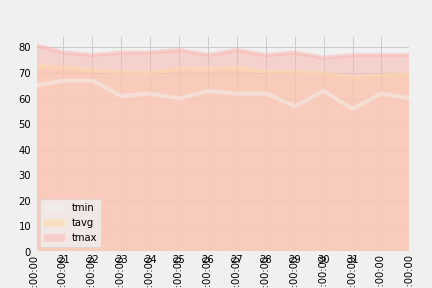

# SQLAlchemy-challenge
Climate analysis for a vacation to Honolulu.
Used SQLAlchemy ORM queries, Pandas, and Matplotlib for this analysis. Vacation range is 3-15 days. Depending on this range we can choose a start date and end date. SQLite database is used.
Used SQLAlchemy automap_base() to reflect your tables into classes and saved a reference to those classes called Station and Measurement.

Precipitation Analysis:
Designed a query to retrieve the last 12 months of precipitation data. The date and prcp values are only selected.

Loaded the query results into a Pandas DataFrame and set the index to the date column.
The DataFrame values are sorted by date.

Ploted the results using the DataFrame plot method.

Station Analysis:

Designed a query to calculate the total number of stations.

Designed a query to find the most active stations.

Listed the stations and observation counts in descending order.

Used functions such as func.min, func.max, func.avg, and func.count in the queries to find which station has the highest number of observations.

Designed a query to retrieve the last 12 months of temperature observation data (tobs).

Filtered by the station with the highest number of observations.

Ploted the results as a histogram with bins=12.

Step 2 - Climate App

Designed a Flask API based on the queries that have just developed.

Used FLASK to create your routes.
Routes
/ : Home page.Lists all routes that are available.

/api/v1.0/precipitation: The query results has been converted to a Dictionary using date as the key and prcp as the value.The JSON representation of the dictionary is returned.

/api/v1.0/stations: Returns a JSON list of stations from the dataset.

/api/v1.0/tobs: query for the dates and temperature observations from a year from the last data point.
Return a JSON list of Temperature Observations (tobs) for the previous year.
When given the start only, calculates TMIN, TAVG, and TMAX for all dates greater than and equal to the start date.

/api/v1.0/<start> and /api/v1.0/<start>/<end>: Return a JSON list of the minimum temperature, the average temperature, and the max temperature for a given start or start-end range.
When given the start and the end date, calculates the TMIN, TAVG, and TMAX for dates between the start and end date inclusive.
  
Temperature Analysis:
calc_temps that will accept a start date and end date in the format %Y-%m-%d and return the minimum, average, and maximum temperatures for that range of dates.

Used the calc_temps function to calculate the min, avg, and max temperatures for your trip using the matching dates from the previous year (i.e., use "2017-01-01" if your trip start date was "2018-01-01").

Ploted the min, avg, and max temperature from your previous query as a bar chart.

Used the average temperature as the bar height.

Used the peak-to-peak (tmax-tmin) value as the y error bar (yerr).

Daily Rainfall Average:

Calculated the rainfall per weather station using the previous year's matching dates.

Calculated the daily normals. Normals are the averages for the min, avg, and max temperatures.
daily_normals that will calculate the daily normals for a specific date. This date string will be in the format %m-%d. Used all historic tobs that match that date string.

Created a list of dates for your trip in the format %m-%d. Used the daily_normals function to calculate the normals for each date string and appends the results to a list.

The list of daily normals is loaded into a Pandas DataFrame and set the index equal to the date.

Used Pandas to plot an area plot (stacked=False) for the daily normals.

